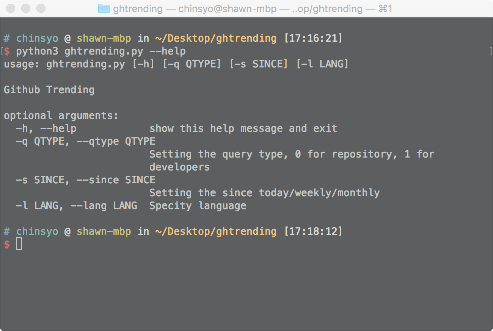
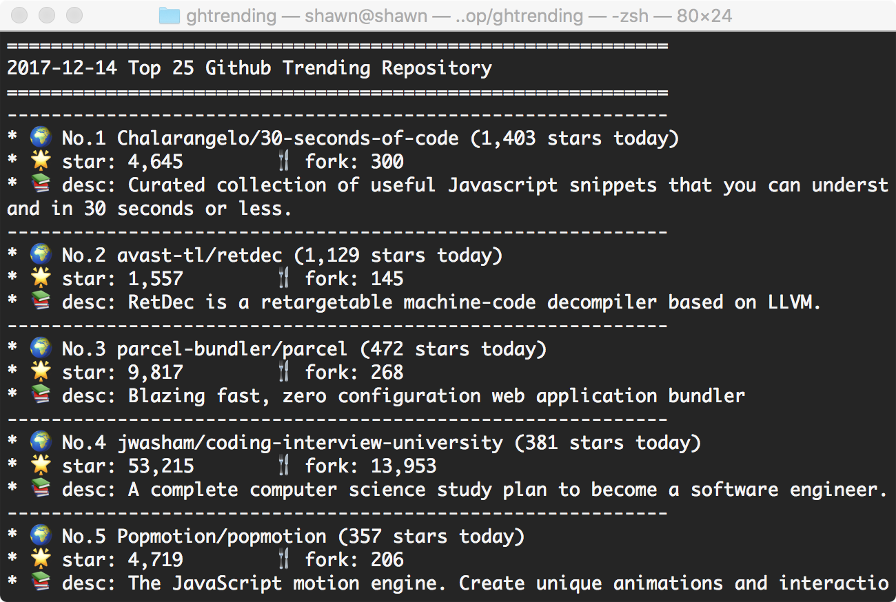
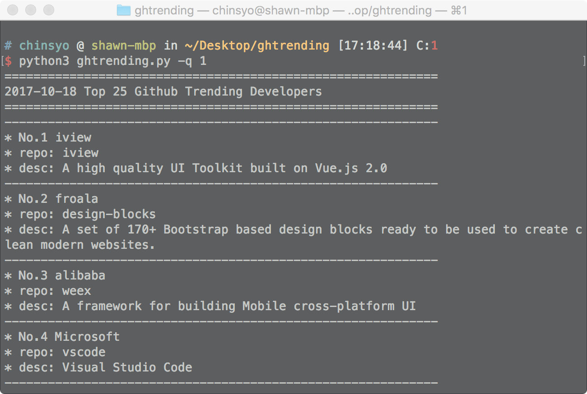

# GHTRENDING

## INTRO

**GHTRENDING** is a commandline tool to view github trending, include developers and repository.





## INSTALL
```shell
// module (recommend)
pip3 install ghtrending

// source
git clone https://github.com/chinsyo/ghtrending.git && cd ghtrending
```

## USAGE
```shell
// module (recommend)
python3 -m ghtrending.ghtrending

// source
python3 ghtrending/ghtrending.py
```

## TODO

* ~~install via pip~~
* oop